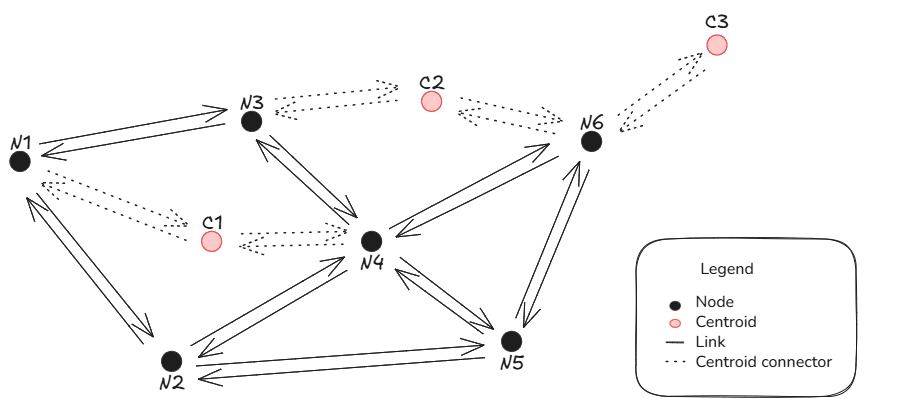

.. _aequilibrae-graphs:

AequilibraE Graphs
==================

The AequilibraE Graph is a computational representation of the network.
The Graph object is rather complex, but the difference between the graph and the physical 
links are the availability of three class member variables consisting of Pandas DataFrames:
the *network*, the *graph*, and the *compressed_graph*.

.. code-block:: python

    >>> from aequilibrae.paths import Graph

    >>> g = Graph()

    >>> g.network # doctest: +SKIP
    >>> g.graph # doctest: +SKIP
    >>> g.compressed_graph # doctest: +SKIP

The network dataframe
---------------------

Links in the *network* table (the Pandas representation of the project's *Links* table) are
potentially bi-directional, and the directions allowed for traversal are dictated by the
field *direction*, where -1 and 1 denote only BA and AB traversal respectively and 0 denotes
bi-directionality.

Direction-specific fields must be coded in fields **_AB** and **_BA**, where the name of
the field in the graph will be equal to the prefix of the directional fields. For example:

The fields *free_flow_travel_time_AB* and *free_flow_travel_time_BA* provide the same
metric (*free_flow_travel_time*) for each of the directions of a link, and the field of
the graph used to set computations (e.g. field to minimize during path-finding, skimming,
etc.) will be *free_flow_travel_time*.

The graph dataframe
-------------------

The graph dataframe is a very simple transformation of the network where all links are **directed**.
This is achieved by decomposing bi-direction links two different links in the graph, each one 
representing a direction.

As described above, fields are made uni-directional, with bi-directional fields being 
transformed into a single field and all other fields remaining the same.

The compressed graph dataframe
------------------------------

The purpose of the compressed graph is to optimize its performance for the more recurrent
and time consuming computations in modelling, which are traffic assignment and skimming.

The key characterist we can leverage to optimize performance for these operations is that paths
are computed only between centroids, therefore two forms of compression are possible:

1. Topological simplification
2. Dead end removal

Topological simplification consists in creating a topological equivalent of the graph
by contracting sequences of links between intersections (extra nodes). These links are often common
in long links.

It is important to note that computations that cannot be handled at the compressed level without 
loss of fidelity, for example the computation of congestion during traffic assignment, is done 
at the uncompressed (graph) level, but we still extract the full benefits of the compression 
at the path-computation stage, which is the most time-consuming portion of assignment.

Dead end removal is an additional procedure, that consists in removing dead ends and fish 
spines from the network. For those
not familiar with the term, a fish spine is a road network with multiple smaller streets
branching off from it, often leading to dead ends or cul-de-sacs, creating a pattern that
resembles a fish spine.

Whilst it's easy for humans to ignore dead ends when planning a route, the same cannot be
said for computers. Dead end removal is done based on the observation that in a graph with
non-negative weights a dead end will only ever appear in the results of a short(est) path if
the origin or destination is present within that dead end.

Dead end removal is applied before topological simplification and results in a distinctive
network, topologically speaking. However, all centroids are preserved. More about dead end removal can be
found `at this blog post <https://www.outerloop.io/blog/20240205_dead_end_removal/>`_.

It should be noted that not all fields are compressed in this process, but only the cost field.

Leveraging topological simplification
-------------------------------------

Topological simplification is a powerful tool that may want to be leveraged for other purposes.
As such, we make it available for users to access it.

For this purpose, the user should be explicit in not removing dead ends from the graph, as that will
result in simplification beyond pure topological simplification.

.. code-block:: python

    >>> graph.prepare_graph(np.array([13, 169, 2197, 28561, 37123], np.int32), remove_dead_ends=False)

Graphs from a model
-------------------

Building graphs directly from an AequilibraE model is the easiest option for beginners
or when using AequilibraE in anger, as much of the setup is done by default.

.. code-block:: python

    >>> project = create_coquimbo_example

    >>> project.network.build_graphs() # We build the graph for all modes
    >>> graph = project.network.graphs['c'] # we grab the graph for cars

Manipulating graphs in memory
-----------------------------

The AequilibraE Graph can be manipulated in memory, with all its components available 
for editing. One of the simple tools available directly in the API is a method call for
excluding one or more links from the Graph, **which is done in place**.

.. code-block:: python

    >>> graph.exclude_links([123, 975])

When working with very large networks, it is possible to filter the database to a small
area for computation by providing a polygon that delimits the desired area, instead of
selecting the links for deletion. The selection of links and nodes is limited to a spatial
index search, which is very fast but not accurate.

.. code-block:: python

    >>> polygon = Polygon([(-71.35, -29.95), (-71.35, -29.90), (-71.30, -29.90), (-71.30, -29.95), (-71.35, -29.95)])
    >>> project.network.build_graphs(limit_to_area=polygon) # doctest: +SKIP

More sophisticated graph editing is also possible, but it is recommended that
changes to be made in the network DataFrame. For example:

.. code-block:: python

    # We can add fields to our graph
    >>> graph.network["link_type"] = project.network.links.data["link_type"]

    # And manipulate them
    >>> graph.network.loc[graph.network.link_type == "motorway", "speed_ab"] = 100
    >>> graph.network.loc[graph.network.link_type == "motorway", "speed_ba"] = 100

Skimming settings
-----------------

Skimming the field of a graph when computing shortest path or performing
traffic assignment must be done by setting the skimming fields in the
Graph object, and there are no limits (other than memory) to the number
of fields that can be skimmed.

.. code-block:: python

    >>> graph.set_skimming(["distance", "travel_time"])

Setting centroids
-----------------

Like other elements of the AequilibraE Graph, the user can also manipulate the
set of nodes interpreted by the software as centroids in the Graph itself.
This brings the advantage of allowing the user to perform assignment of partial
matrices, matrices of travel between arbitrary network nodes and to skim the network
for an arbitrary number of centroids in parallel, which can be useful when using
AequilibraE as part of more general analysis pipelines. As seen above, this is also
necessary when the network has been manipulated in memory.

**When setting regular network nodes as centroids, the user should take care in
not blocking flows through "centroids".**

.. code-block:: python

    >>> graph.prepare_graph(np.array([13, 169, 2197, 28561, 37123], np.int32))
    >>> graph.set_blocked_centroid_flows(False)

.. seealso::

    * :func:`aequilibrae.paths.Graph`
        Class documentation
    * :func:`aequilibrae.paths.TransitGraph`
        Class documentation

Blocking flows through centroids
--------------------------------

When using AequilibraE Graph, it is possible to configure if one wants to allow paths
through centroids or not. As centroid connectors are a bi-directional link type, in
practice what blocking flows through centroids does is 'removing' graph links leaving
from the centroid.

Suppose one wants to compute the shortest path between node N1 and centroid C3 in the 
figure below. An initial path guess would be N1 -> N3 -> C2 -> N6 -> C3 because all
links are bi-directional. However, when we block paths through centroids, it is not
possible to compute the path between C2 and N6 because we 'removed' the link leaving
from the centroid.

