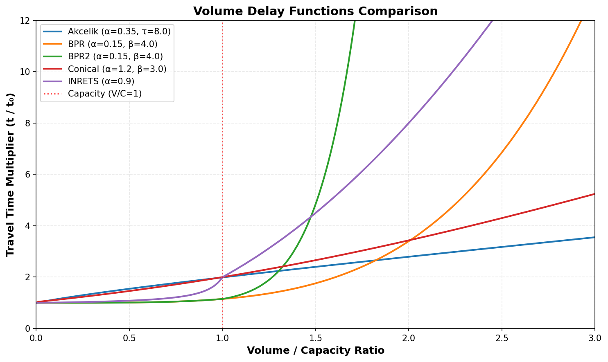
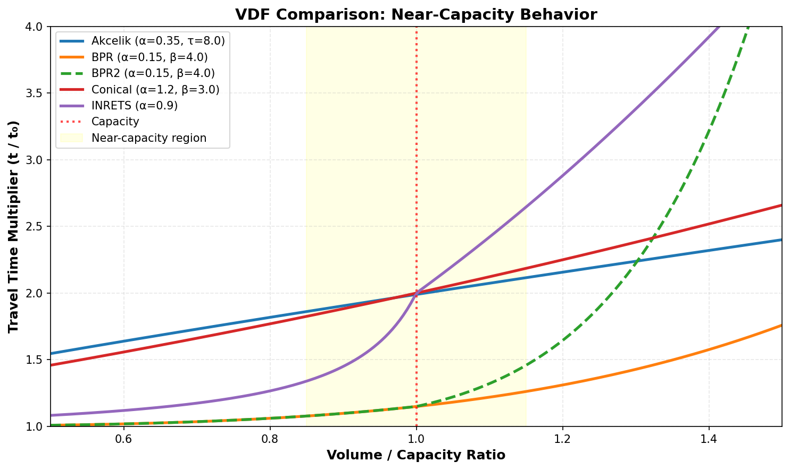
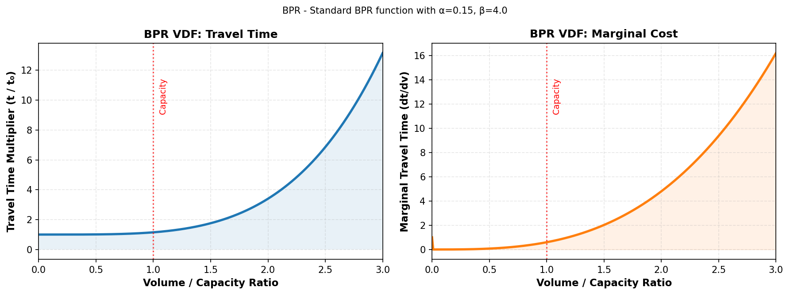
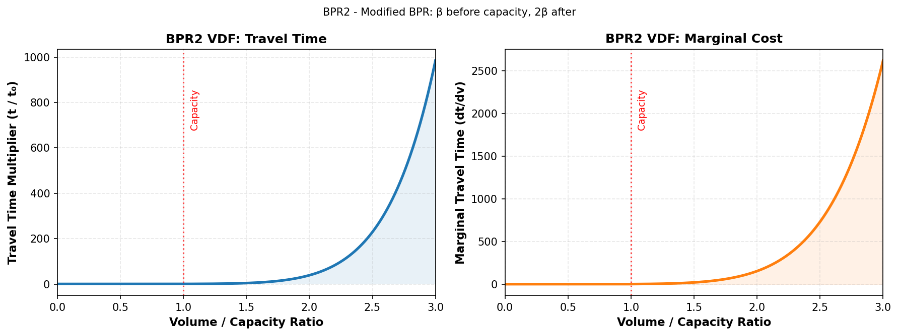
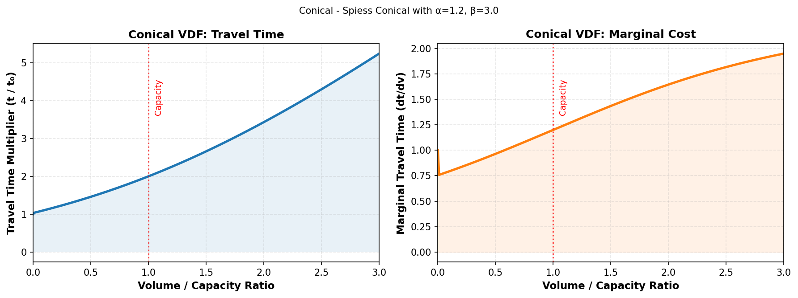
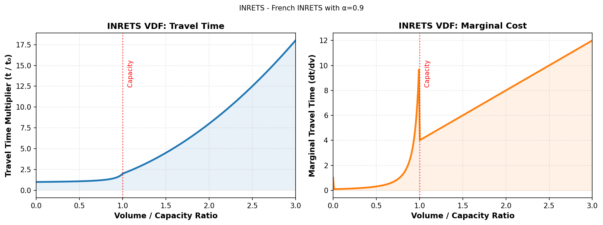
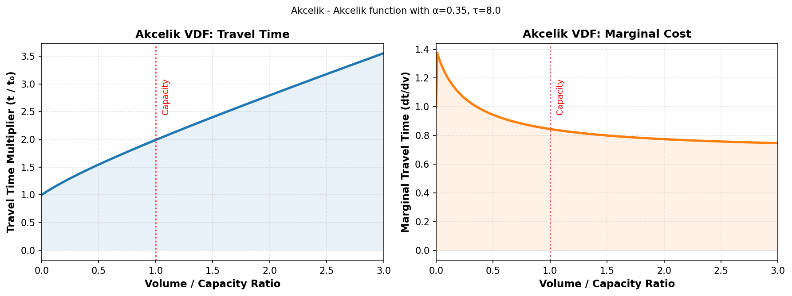

.. _volume_delay_functions:

Volume Delay Functions
======================

Volume Delay Functions (VDFs) are mathematical functions that describe the relationship between link 
travel time and traffic volume. They are essential components of traffic assignment models, representing 
how congestion affects travel times as more vehicles use a link.

AequilibraE implements five different VDF formulations, each with distinct characteristics that make 
them suitable for different modeling traditions.

Available VDF Functions
-----------------------

AequilibraE currently supports the following VDF functions:

* **BPR** - Bureau of Public Roads (traditional)
* **BPR2** - Modified BPR with enhanced sensitivity after capacity
* **Conical** - Spiess' Conical function  
* **INRETS** - French INRETS function
* **Akcelik** - Akcelik's function for signalized intersections

VDF Comparison
--------------

The following chart compares the behavior of all available VDF functions with their example values:

**Key observations:**

* All functions show increasing travel times as the Volume/Capacity (V/C) ratio increases
* Functions differ significantly in their behavior near and above capacity (V/C = 1)
* BPR and Conical are smooth throughout the range
* BPR2 and INRETS have distinct behavioral changes at capacity
* Akcelik shows moderate growth rates suitable for signalized intersections

Near-Capacity Behavior
~~~~~~~~~~~~~~~~~~~~~~

The behavior of VDFs near capacity is particularly important for congested urban networks:

This zoomed view (V/C from 0.5 to 1.5) highlights the differences in how each function transitions 
from free-flow to congested conditions.

Detailed VDF Descriptions
--------------------------

BPR (Bureau of Public Roads)
~~~~~~~~~~~~~~~~~~~~~~~~~~~~~

**Mathematical Formula:**

.. math:: t = t_0 \left(1 + \alpha \left(\frac{v}{c}\right)^\beta\right)

Where:
  * :math:`t` = congested travel time
  * :math:`t_0` = free-flow travel time
  * :math:`v` = volume (flow) on the link
  * :math:`c` = capacity of the link
  * :math:`\alpha` = calibration parameter
  * :math:`\beta` = calibration parameter (power)

**Standard Parameters:**
  * :math:`\alpha = 0.15`
  * :math:`\beta = 4.0`

**Origin and Background:**

The BPR function was developed by the U.S. Bureau of Public Roads in the 1960s and has become the 
most widely used VDF in transportation planning. Its simplicity and effectiveness have made it the 
standard choice for highway assignment models worldwide.

**Characteristics:**

* Continuous and smooth across all volume levels
* Monotonically increasing (no discontinuities)
* Convex function ensuring convergence in assignment algorithms
* Well-suited for highway networks
* Standard parameters are based on extensive empirical studies

**When to Use:**

* Highway and freeway networks
* Long-distance travel modeling
* When computational stability is critical
* As a baseline for comparison with other functions
* When empirical data supports the standard parameters

**Limitations:**

* May underestimate congestion effects at very high V/C ratios
* Less suitable for signalized urban arterials

BPR2 (Modified BPR)
~~~~~~~~~~~~~~~~~~~

**Mathematical Formula:**

Before capacity (:math:`v \leq c`):

.. math:: t = t_0 \left(1 + \alpha \left(\frac{v}{c}\right)^\beta\right)

After capacity (:math:`v > c`):

.. math:: t = t_0 \left(1 + \alpha \left(\frac{v}{c}\right)^{2\beta}\right)

**Standard Parameters:**
  * :math:`\alpha = 0.15`
  * :math:`\beta = 4.0`

**Origin and Background:**

BPR2 is a modification of the traditional BPR function designed to better represent the rapid 
deterioration of traffic conditions when demand exceeds capacity. The doubling of the exponent 
after capacity creates a steeper penalty for over-capacity conditions.

**Characteristics:**

* Piecewise function with a transition at V/C = 1
* Much steeper increase in travel time after capacity is exceeded
* Maintains BPR behavior below capacity
* Non-differentiable at V/C = 1 (but continuous)
* More aggressive congestion penalty than standard BPR

**When to Use:**

* Networks with strong capacity constraints
* Modeling scenarios where over-capacity conditions should be heavily penalized
* Mixed networks with both highways and congested urban roads
* When trying to prevent unrealistic over-assignment

**Limitations:**

* Non-differentiable point at capacity may cause convergence issues in some algorithms
* The sharp transition may not reflect real-world gradual congestion buildup
* Requires careful calibration of the transition behavior

Conical (Spiess)
~~~~~~~~~~~~~~~~

**Mathematical Formula:**

.. math:: t = t_0 \left(2 + \sqrt{\alpha^2\left(1-\frac{v}{c}\right)^2 + \beta^2} - \alpha\left(1-\frac{v}{c}\right) - \beta\right)

**Standard Parameters:**
  * :math:`\alpha = 0.15`
  * :math:`\beta = 4.0`

**Origin and Background:**

Developed by Heinz Spiess in 1990, the Conical function was designed to overcome some theoretical 
limitations of the BPR function while maintaining computational tractability. It ensures positive 
derivatives everywhere and has desirable mathematical properties for convergence.

**Characteristics:**

* Infinitely differentiable (smooth everywhere)
* Asymptotic behavior as V/C approaches infinity
* Guaranteed positive marginal costs
* Strong theoretical foundation
* Good convergence properties in equilibrium algorithms

**When to Use:**

* When theoretical rigor is important
* Transit assignment (where it was originally designed)
* Networks requiring guaranteed convergence
* Academic studies and benchmarking
* When smooth derivatives are required throughout

**Limitations:**

* Less intuitive parameterization than BPR
* May require specialized calibration
* Not as widely validated in practice as BPR
* Parameters have different interpretations than BPR

INRETS (French)
~~~~~~~~~~~~~~~

**Mathematical Formula:**

Before capacity (:math:`v \leq c`):

.. math:: t = t_0 \frac{1.1 - \alpha\frac{v}{c}}{1.1 - \frac{v}{c}}

After capacity (:math:`v > c`):

.. math:: t = t_0 \frac{1.1 - \alpha}{0.1} \left(\frac{v}{c}\right)^2

**Standard Parameters:**
  * :math:`\alpha = 1.0` (must be :math:`<= 1.0`)

**Origin and Background:**

The INRETS function was developed by the French National Institute for Transport and Safety Research 
(Institut National de Recherche sur les Transports et leur Sécurité). It was designed specifically 
for French urban networks and reflects European traffic flow characteristics.

**Characteristics:**

* Piecewise function with distinct before/after capacity behavior
* The :math:`\alpha` parameter must be less than or equal to 1.0
* Hyperbolic behavior before capacity
* Quadratic behavior after capacity
* Designed for urban arterial roads
* Reflects observed traffic patterns in French cities

**When to Use:**

* Urban arterial networks
* European-style road networks
* When modeling contexts similar to French urban environments
* Networks with well-defined capacity constraints
* Calibrated models for specific urban areas

**Limitations:**

* Restricted parameter range (:math:`\alpha <= 1.0`)
* Non-differentiable at V/C = 1
* Less widely used outside of Europe
* May require local calibration
* Dramatic change in behavior at capacity may not suit all networks

Akcelik
~~~~~~~

**Mathematical Formula:**

.. math:: t = t_0 + \alpha\left(z + \sqrt{z^2 + \frac{\tau v}{c^2}}\right)

Where :math:`z = \frac{v}{c} - 1`

**Standard Parameters:**
  * :math:`\alpha = 0.25`
  * :math:`\tau = 0.8` (this is :math:`8 \times 0.1`, see note below)

**Origin and Background:**

Developed by Rahmi Akcelik, this function was specifically designed for signalized intersections 
and urban arterials. It incorporates queue theory and reflects the delay characteristics of 
traffic signals.

**Important Note on τ Parameter:**

In standard Akcelik formulations, the function includes a factor of 8 in the formula. However, 
in AequilibraE's implementation, this factor of 8 has been absorbed into the :math:`\tau` parameter 
for computational efficiency. 

**What this means for users:**

* If academic literature references a :math:`\tau` value (e.g., 0.1), you must multiply it by 8 
  before setting it in AequilibraE
* Example: To use :math:`\tau = 0.1`, set ``tau = 0.8`` in AequilibraE
* Example: To use :math:`\tau = 0.15`, set ``tau = 1.2`` in AequilibraE
* A value of 0.8 corresponds to a standard :math:`\tau = 0.1`

**Characteristics:**

* Specifically designed for signalized intersections
* Includes queue-based delay components
* Smooth transition through capacity
* More moderate growth than BPR at high V/C ratios
* Grounded in traffic signal theory

**When to Use:**

* Urban networks with signalized intersections
* Arterial roads with frequent signals
* Australian and some Asian modeling contexts (where it's more common)

**Limitations:**

* Less intuitive than BPR for general highway modeling
* Parameter interpretation requires understanding of signal timing
* May underestimate delay on uninterrupted flow facilities
* Less validated for freeway applications

Parameter Selection Guidelines
-------------------------------

General Recommendations
~~~~~~~~~~~~~~~~~~~~~~~

**For BPR and BPR2:**

* :math:`\alpha = 0.15` and :math:`\beta = 4.0` are widely accepted for highways
* Urban arterials may benefit from :math:`\alpha` values between 0.15 and 0.25
* Higher :math:`\beta` values (5-8) create sharper congestion curves
* Lower :math:`\beta` values (2-3) create more gradual curves

**For Conical:**

* Can use similar values to BPR as starting points
* :math:`\alpha = 0.15` and :math:`\beta = 4.0` provide comparable behavior to BPR
* Fine-tuning may require understanding of the specific mathematical properties

**For INRETS:**

* :math:`\alpha = 1.0` is standard
* Must satisfy :math:`\alpha <= 1.0`
* Higher values create steeper curves before capacity

**For Akcelik:**

* :math:`\alpha = 0.25` is typical for signalized intersections
* :math:`\tau` should reflect local traffic signal characteristics
* Remember to use :math:`8 \times \tau` in AequilibraE

Calibration Considerations
~~~~~~~~~~~~~~~~~~~~~~~~~~~

When calibrating VDF parameters:

1. **Use observed data**: Speed-flow or travel time-volume data from your network
2. **Consider facility types**: Highways, arterials, and local streets may need different parameters
3. **Validate results**: Compare assigned volumes and speeds against counts
4. **Test sensitivity**: Understand how parameter changes affect results
5. **Check convergence**: Ensure your chosen parameters allow the algorithm to converge
6. **Match local conditions**: Standard parameters may not suit all geographic contexts

Setting VDF Parameters in AequilibraE
--------------------------------------

In AequilibraE, VDF parameters can be set either as network-wide constants or as link-specific 
attributes:

**Network-wide parameters:**

.. code-block:: python

    from aequilibrae.paths import TrafficAssignment
    
    assig = TrafficAssignment()
    assig.set_vdf('BPR')
    assig.set_vdf_parameters({"alpha": 0.15, "beta": 4.0})

**Link-specific parameters:**

.. code-block:: python

    # Parameters can reference field names in your network
    assig.set_vdf_parameters({"alpha": "alpha_field", "beta": "beta_field"})

This flexibility allows you to:

* Use different parameters for different facility types
* Implement spatially varying congestion characteristics  
* Calibrate specific links or corridors independently

Choosing the Right VDF
-----------------------

Decision Framework
~~~~~~~~~~~~~~~~~~

Use this decision tree to help select an appropriate VDF:

**For Highway Networks:**
  * Start with **BPR** - it's well-validated and robust
  * Consider **BPR2** if you need stronger over-capacity penalties
  * Use **Conical** for theoretical/academic studies

**For Urban Networks:**
  * Use **Akcelik** for signalized arterial networks
  * Consider **INRETS** for European-style urban contexts
  * **BPR** works as a general fallback

**For Mixed Networks:**
  * **BPR** or **BPR2** provide good general performance
  * Consider using link-specific parameters to vary behavior by facility type

**For Transit Assignment:**
  * **Conical** was originally designed for transit applications

Computational Considerations
~~~~~~~~~~~~~~~~~~~~~~~~~~~~~

* **BPR** and **Akcelik**: Smooth everywhere, excellent convergence
* **Conical**: Best mathematical properties, guaranteed convergence
* **BPR2** and **INRETS**: Non-differentiable at capacity, may need more iterations
* All functions are computationally efficient in AequilibraE

Performance Comparison
~~~~~~~~~~~~~~~~~~~~~~

While individual network characteristics vary, general patterns include:

* **BPR**: Most widely validated, good general performance
* **BPR2**: Better for preventing unrealistic over-capacity assignment
* **Conical**: Excellent convergence behavior, less intuitive calibration
* **INRETS**: Good for specific urban contexts, may need local calibration
* **Akcelik**: Best for signalized urban networks

Examples
--------

Basic Usage
~~~~~~~~~~~

.. code-block:: python

    from aequilibrae.paths import TrafficAssignment, TrafficClass, VDF
    
    # Check available VDF functions
    vdf = VDF()
    print(vdf.functions_available())
    # Output: ['bpr', 'bpr2', 'conical', 'inrets', 'akcelik']
    
    # Setup traffic assignment with BPR
    assig = TrafficAssignment()
    assig.set_vdf('BPR')
    assig.set_vdf_parameters({"alpha": 0.15, "beta": 4.0})

Using Different VDFs
~~~~~~~~~~~~~~~~~~~~

.. code-block:: python

    # Highway network - standard BPR
    assig.set_vdf('BPR')
    assig.set_vdf_parameters({"alpha": 0.15, "beta": 4.0})
    
    # Urban network with signals - Akcelik
    assig.set_vdf('AKCELIK')
    assig.set_vdf_parameters({"alpha": 0.25, "tau": 0.8})
    
    # Network with strong capacity constraints - BPR2
    assig.set_vdf('BPR2')
    assig.set_vdf_parameters({"alpha": 0.15, "beta": 4.0})

Link-Specific Parameters
~~~~~~~~~~~~~~~~~~~~~~~~~

.. code-block:: python

    # Assume your network has fields 'alpha_field' and 'beta_field'
    # with values calibrated for each link
    assig.set_vdf('BPR')
    assig.set_vdf_parameters({"alpha": "alpha_field", "beta": "beta_field"})

References and Further Reading
-------------------------------

**BPR Function:**

* Bureau of Public Roads (1964). *Traffic Assignment Manual*. U.S. Department of Commerce.

**Conical Function:**

* Spiess, H. (1990). "Technical Note—Conical Volume-Delay Functions." *Transportation Science*, 24(2): 153-158. 
  https://doi.org/10.1287/trsc.24.2.153
* Hampton Roads Transportation Planning Organization (2020). *Regional Travel Demand Model V2 Methodology Report*. 
  Available: https://www.hrtpo.org/uploads/docs/2020_HamptonRoads_Modelv2_MethodologyReport.pdf 
  (accessed February 2026)

**Akcelik Function:**

* Akcelik, R. (1991). "Travel Time Functions for Transport Planning Purposes: Davidson's Function, Its Time Dependent Form and an Alternative Travel Time Function." 
  *Australian Road Research*, 21(3): 49-59.

**General Traffic Assignment:**

* Sheffi, Y. (1985). *Urban Transportation Networks: Equilibrium Analysis with Mathematical Programming Methods*. 
  Prentice-Hall, Englewood Cliffs, NJ.
* Patriksson, M. (1994). *The Traffic Assignment Problem: Models and Methods*. VSP, Utrecht.

**Multi-class Assignment:**

* Zill, J., Camargo, P., Veitch, T., Daisy, N. (2019). "Toll Choice and Stochastic User Equilibrium: Ticking All the Boxes." 
  *Transportation Research Record*, 2673(4): 930-940. https://doi.org/10.1177/0361198119837496
